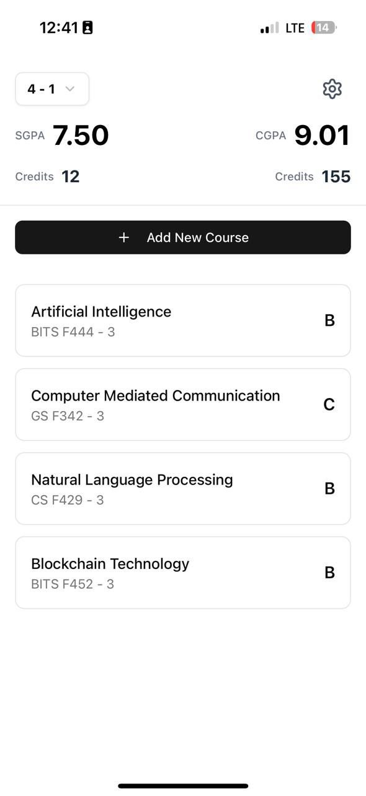
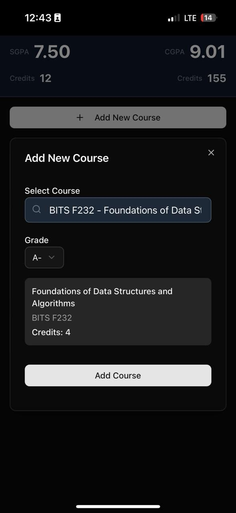

# CGPA Calculator

CGPA Calculator PWA is a progressive web app to help students log semester-wise courses, credits, and grades to automatically compute SGPA and CGPA. Add, update, or remove courses as you go.

  
  &nbsp; &nbsp;
  

## Installation

This CGPA Calculator is a PWA (Progressive Web App), which means you can install it on your mobile device just like a native app. Updates roll out automatically.

### Android

Open the app in Chrome or any Chromium-based browser (like Brave).

You will see an ``Install`` button in the browser address bar or in the application.

Works best on Chrome 80+ with automatic install prompt.

### iOS

Installing on iOS (Safari only):

Open the app in Safari.

Tap the Share icon (bottom center).

Select “Add to Home Screen”.

Tap Add in the top-right corner.

The app will appear in your app drawer and function like a native app.